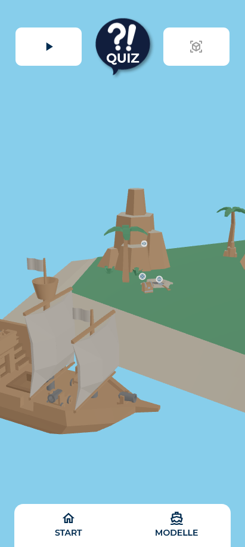
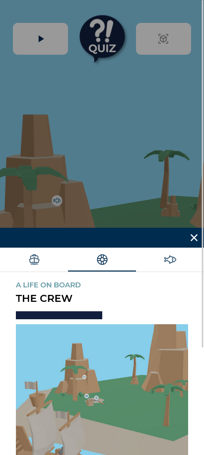
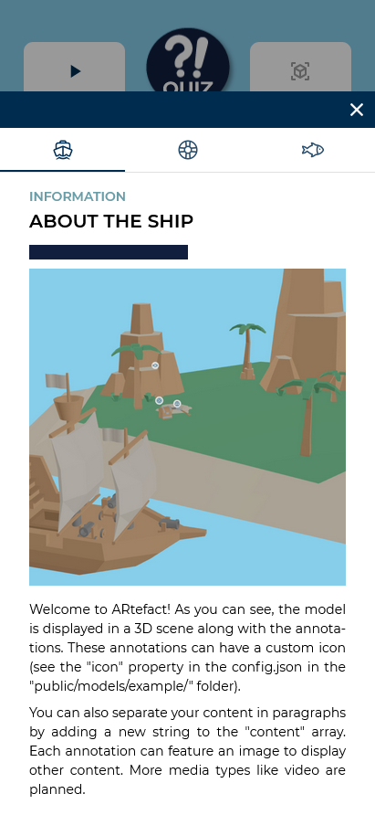

<a name="readme-top"></a>

<div align="center">

[![License][license-shield]][license-url] [![View Demo][demo-shield]][demo-url]

</div>

# About ARtefact

ARtefact is an interactive application for displaying 3D models and annotating highlights on the model with additional content like text, images and audio.

It has been co-developed at the [German Maritime Museum](https://dsm.museum) with teachers and students from Bremerhaven with research results available at [https://dl.acm.org/doi/abs/10.1145/3656585](https://dl.acm.org/doi/abs/10.1145/3656585).

It's possible to use this app to display your own content. If you need help or encounter any problems adding your own 3D models or content, feel free to contact us.

## Features

- Show your various 3D models in an interactive viewer
- Play an animation that further explains your artefact
- Test the knowledge of your visitos in a configurable and fun quiz
- Attach annotations to interesting parts of your 3D model and add accompanying text info in a separate info layer (see below)

## Showcase

<p align="middle">
  
  
  
</p>

<div align="center">

Our deployed version with adapted content can be found here:

[![View Demo][demo-shield]][demo-url]

</div>

## Installing / Getting started

ARtefact needs at least Node 14 to run. For install instructions, visit the [Node.js documentation](https://docs.npmjs.com/downloading-and-installing-node-js-and-npm).

After having installed Node.js and the npm package manager, install the dependencies needed to run the project

```bash
npm install
```

## Developing

Start the dev server on port 8080.
The app is then available via [http://localhost:8080](http://localhost:8080)

To configure https, see [these instructions](https://quasar.dev/quasar-cli-vite/developing-pwa/handling-service-worker#ssl-certificate).

```bash
npm run dev
```

## Building

Build the app for deploying it on a server

```bash
npm run build
```

The app will be built to `dist/pwa` and can then be hosted on a webserver.

## Add your own models

ARtefact generates a separate page for each model. A model is defined as an entry in the `src/config.json` main file. See the current examples for details.

Every model and its files are placed in an own folder inside of `public/models`. To add a new model to the app, create a new folder and place the files there.

For a basic setup you will only need a folder and the 3d model you want to show.

If you have a model named `MyShip` together wtith some media files, the folder could look like this:

```
📂 public/models/
└── 📂 MyShip/
    ├── model.glb
    └── 📂 media/
        ├── 🖼️ thumbnail.jpg
        ├── 🖼️ interior.jpg
        ├── 🖼️ work.png
        ├── 🖼️ icon-about.png
        ├── 🎞️ interior.mp4
        ├── 🎞️ exterior.mp4
        └── [...]
```

## Branding

To change the apps appearance to fit your corporate design, you can change logos, fonts, colors and more. For more information, see also [Quasar - Adding your own colors](https://quasar.dev/style/color-palette#adding-your-own-colors).

### Colors

To change the colors, change the variables in `src\css\quasar.variables.scss`:

```css
$primary: #002c50;
$secondary: #699da8;
$accent: #9c27b0;

$dark: #1d1d1d;

$positive: #21ba45;
$negative: #c10015;
$info: #31ccec;
$warning: #f2c037;
```

### Font

You can change the font in `src\css\app.scss`.

Montserrat is used as the default font for normal and bold font styles:

```css
// Montserrat as an OFL example
@font-face {
  font-family: Montserrat;
  src: url(./fonts/Montserrat-Regular.ttf);
  font-weight: normal;
}

@font-face {
  font-family: Montserrat;
  src: url(./fonts/Montserrat-SemiBold.ttf);
  font-weight: bold;
}
```

### App name and icon

You can generate your own icon with the icongenie helper (https://quasar.dev/icongenie/command-list).

To create a good set of icons with padding use the following command:

```js
./node_modules/.bin/icongenie generate -i ./src/assets/logo.png --padding 20,20
```

To change the name and icon of the Progressive Web App, change the "name" value in the `src-pwa/manifest.json` file:

```js
{
  "name": "ARtefact",
  "short_name": "ARtefact",
  "description": "View our 3d models in our Progressive Web App",
  "display": "standalone",
  "orientation": "portrait",
  "background_color": "#ffffff",
  "start_url": "./",
  "scope": "./",
  "theme_color": "#002c50",
  "icons": [
    {
      "src": "icons/icon-128x128.png",
      "sizes": "128x128",
      "type": "image/png"
    },

    // ...

  ]
}
```

<!-- CONTRIBUTING -->

## Contributing

Any contributions you make are **greatly appreciated** and will make ARtefact better over time.

If you have a suggestion that would make this better, please fork the repo and create a pull request. You can also simply open an issue with the tag "enhancement".

1. Fork the Project
2. Create your Feature Branch (`git checkout -b feature/AmazingFeature`)
3. Commit your Changes (`git commit -m 'Add some AmazingFeature'`)
4. Push to the Branch (`git push origin feature/AmazingFeature`)
5. Open a Pull Request

## Licensing

ARtefact is distributed under the MIT License. See the [license](./LICENSE) for more information.

<div align="center">

[![Back][back-to-top-shield]][back-to-top-url]

</div>

<!-- links and images -->
<!-- https://www.markdownguide.org/basic-syntax/#reference-style-links -->

[license-shield]: https://img.shields.io/github/license/dsm-museum/artefact.svg?style=for-the-badge
[license-url]: https://github.com/dsm-museum/artefact/blob/main/LICENSE
[demo-shield]: https://img.shields.io/badge/View_our_application-002c50?style=for-the-badge
[demo-url]: https://3d.dsm.museum/ar
[vue-shield]: https://img.shields.io/badge/Vue.js-35495E?style=for-the-badge&logo=vuedotjs&logoColor=4FC08D
[vue-url]: https://vuejs.org
[quasar-shield]: https://img.shields.io/badge/Quasar-00b4ff?style=for-the-badge&logo=quasar
[quasar-url]: https://quasar.dev/
[three-shield]: https://img.shields.io/badge/three.js-000000?style=for-the-badge&logo=three.js
[three-url]: https://threejs.org/
[back-to-top-shield]: https://img.shields.io/badge/%E2%96%B2_Back_To_Top_%E2%96%B2-002C50?style=for-the-badge
[back-to-top-url]: https://github.com/dsm-museum/artefact/tree/main/#readme-top
