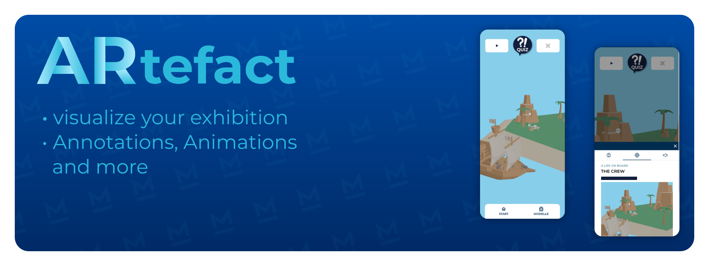

<a name="readme-top"></a>


<div align="center">

[![License][license-shield]][license-url] [![View Demo][demo-shield]][demo-url]

</div>

# About the framework

 is a framework for displaying 3D models, adding annotations and connecting content to them, all in a Progressive Web App. It is developed at the [German Maritime Museum](https://dsm.museum) and built with three.js and Quasar.

If you encounter any problems adding your own 3D models or content, feel free to contact us. We are here to help.

### Built with

[![Vue][vue-shield]][vue-url]

[![Quasar][quasar-shield]][quasar-url]

[![three.js][three-shield]][three-url]

## Features

- Show your various 3D models in an interactive viewer
- Play an animation that further explains your artefact
- Test the knowledge of your visitos in a configurable and fun quiz
- Attach annotations to interesting parts of your 3D model and add accompanying text info in a separate info layer (see below ▼)

## Showcase

<p align="middle">
  
  
  
</p>

<div align="center">

Our deployed version with adapted content can be found here:

[![View Demo][demo-shield]][demo-url]

</div>

## Installing / Getting started

 needs at least Node 14 to run. For install instructions, visit the [Node.js documentation](https://docs.npmjs.com/downloading-and-installing-node-js-and-npm).

After having installed Node.js and the npm package manager, install the dependencies needed to run the project

```bash
npm install
```

## Developing

Start the dev server on port 8080.
The app is then available via [http://localhost:8080](http://localhost:8080)

To configure https, see [these instructions](https://quasar.dev/quasar-cli-vite/developing-pwa/handling-service-worker#ssl-certificate).

```bash
quasar dev
```

## Building

Build the app for deploying it on a server

```bash
quasar build -m pwa
```

The app will be built to `dist/pwa` and can then be hosted with a webserver.

## Configuration

You can add your own model and content by supplying the app with a text file that configures the model and corresponding media files like images and videos. They will be used to build a new page and add it to the model list.

For a basic setup you will only need a folder, the 3d model you want to show and the config.json file

Every model and its files are placed in an own folder inside of `src/models`. To add a new model to the app, create a new folder and place the files there.

If you have a model named `MyShip`, the folder could look like this:

```
📂 src/models/
└── 📂 MyShip/
    ├── model.glb
    ├── config.json
    └── 📂 media/
        ├── 🖼️ thumbnail.jpg
        ├── 🖼️ interior.jpg
        ├── 🖼️ work.png
        ├── 🖼️ icon-about.png
        ├── 🎞️ interior.mp4
        ├── 🎞️ exterior.mp4
        └── [...]
```

For every model, the app needs a config file specifying the model file, annotations and more. See the [`public/models/example/config.json`](./public/models/example/config.json) file for an example:

```json
{
  "title": "My Ship",
  "model": "model.glb",
  "annotations": [
    {
      "id": "first-annotation",
      "icon": "media/icon-about.png",
      "position": [1.0, 0.6, 2.4],
      "media": "media/interior.jpg",
      "content": [
        "This is the annotation",
        "with multiple paragraphs of",
        "Content."
      ]
    }
  ]
}
```

## Branding

To change the apps appearance to fit your corporate design, you can change logos, fonts, colors and more. For more information, see also [Quasar - Adding your own colors](https://quasar.dev/style/color-palette#adding-your-own-colors).

### Colors

To change the colors, change the variables in `src\css\quasar.variables.scss`:

```css
$primary: #002c50;
$secondary: #699da8;
$accent: #9c27b0;

$dark: #1d1d1d;

$positive: #21ba45;
$negative: #c10015;
$info: #31ccec;
$warning: #f2c037;
```

### Font

You can change the font in `src\css\app.scss`.

Montserrat is used as the default font for normal and bold font styles:

```css
// Montserrat as an OFL example
@font-face {
  font-family: Montserrat;
  src: url(./fonts/Montserrat-Regular.ttf);
  font-weight: normal;
}

@font-face {
  font-family: Montserrat;
  src: url(./fonts/Montserrat-SemiBold.ttf);
  font-weight: bold;
}
```

### App name and icon

To change the name and icon of the Progressive Web App, change the `manifest` section of the `quasar.conf.js` file:

```js
manifest: {
  name: `My App`,
  short_name: `App`,
  description: `View our 3d models in our Progressive Web App`,
  display: 'standalone',
  orientation: 'portrait',
  background_color: '#ffffff',
  start_url: './',
  scope: './',
  theme_color: '#002c50', // this colors in elements of the OS and browser
  icons: [
    {
      src: 'icons/icon-128x128.png', // swap these files to change the icon
      sizes: '128x128',
      type: 'image/png',
    },
    ...
  ]
},
...
```

<!-- CONTRIBUTING -->

## Contributing

Any contributions you make are **greatly appreciated** and will make ARtefact better over time.

If you have a suggestion that would make this better, please fork the repo and create a pull request. You can also simply open an issue with the tag "enhancement".

1. Fork the Project
2. Create your Feature Branch (`git checkout -b feature/AmazingFeature`)
3. Commit your Changes (`git commit -m 'Add some AmazingFeature'`)
4. Push to the Branch (`git push origin feature/AmazingFeature`)
5. Open a Pull Request

## Licensing

ARtefact is distributed under the MIT License. See the [license](./LICENSE) for more information.

<div align="center">

[![Back][back-to-top-shield]][back-to-top-url]

</div>

<!-- links and images -->
<!-- https://www.markdownguide.org/basic-syntax/#reference-style-links -->

[license-shield]: https://img.shields.io/github/license/dsm-museum/artefact.svg?style=for-the-badge
[license-url]: https://github.com/dsm-museum/artefact/blob/main/LICENSE
[demo-shield]: https://img.shields.io/badge/View_our_demo-002c50?style=for-the-badge
[demo-url]: https://3d.dsm.museum/ar
[vue-shield]: https://img.shields.io/badge/Vue.js-35495E?style=for-the-badge&logo=vuedotjs&logoColor=4FC08D
[vue-url]: https://vuejs.org
[quasar-shield]: https://img.shields.io/badge/Quasar-00b4ff?style=for-the-badge&logo=quasar
[quasar-url]: https://quasar.dev/
[three-shield]: https://img.shields.io/badge/three.js-000000?style=for-the-badge&logo=three.js
[three-url]: https://threejs.org/
[back-to-top-shield]: https://img.shields.io/badge/%E2%96%B2_Back_To_Top_%E2%96%B2-002C50?style=for-the-badge
[back-to-top-url]: https://github.com/dsm-museum/artefact/tree/main/#readme-top
